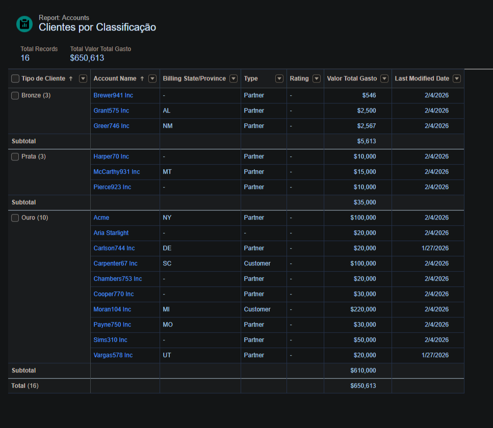
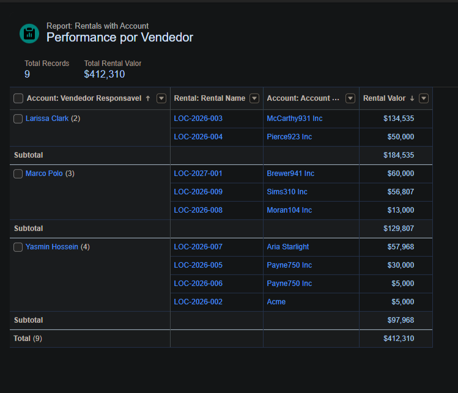
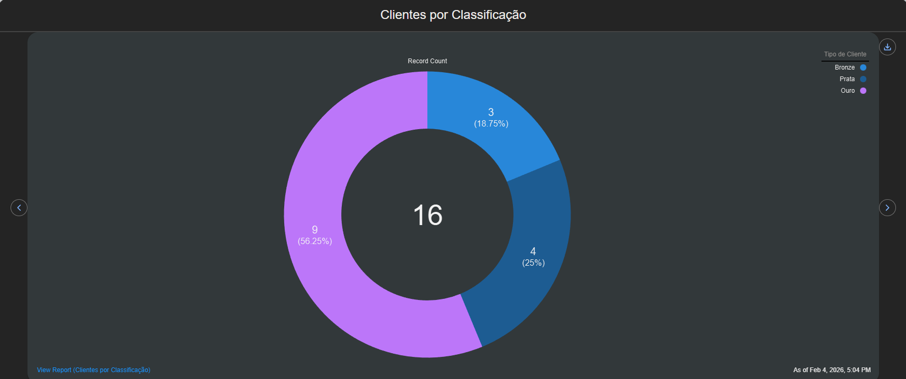
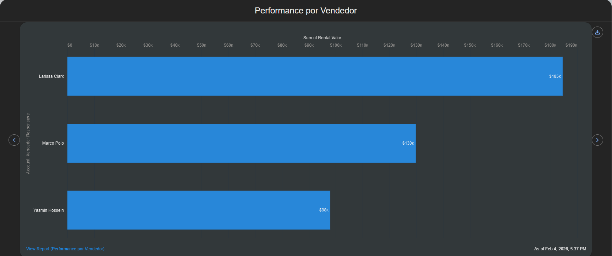

# Salesforce-intelligent-customer-management-Part-2
Solução Salesforce para automação avançada de classificação de clientes, integração de LWC com Apex, gestão de locações e dashboards interativos com relatórios e notificações automáticas.

## 📘 Guia Prático de Implementação – Parte 2 | 

 

## 📌 1️⃣ Contexto do Projeto

No Desafio 2, o objetivo foi avançar na solução Salesforce da EveryDrive, com foco em:  

• Desenvolvimento do projeto SFDX no VS Code, integrando com a org Salesforce  
• Criação de um componente LWC (`customerMedal`) para exibir o nome do cliente e sua medalha de fidelidade  
• Trigger no objeto `Rental` para automatizar follow-ups e garantir integridade do processo  
• Relatórios e painéis interativos para análise de faturamento e performance da equipe  
• Notificações automáticas para vendedores sobre clientes estratégicos  

Essa etapa permitiu elevar a solução do Desafio 1, automatizando processos críticos e melhorando a visualização dos dados para a equipe comercial.

---

## 📌 2️⃣ Objetivos da Solução

• **Padronização de Dados:** Centralização de Contas e Locações  
• **Automação Inteligente:** Classificação automática de clientes (Bronze, Silver, Gold) via Apex, eliminando erro humano  
• **Business Intelligence:** Dashboards em tempo real para acompanhamento de faturamento por vendedor e segmentação da base  

---

## 📌 3️⃣ Arquitetura de Dados e Recursos Visuais

### Passo 1 – Criação de Campos de Imagem

Configuração de campos para armazenar as imagens JPG referências das medalhas (Bronze, Silver e Gold)  

Setup → Static Resources → New → Bronze_Medal → escolher arquivo → Save  
Setup → Static Resources → New → Silver_Medal → escolher arquivo → Save  
Setup → Static Resources → New → Gold_Medal → escolher arquivo → Save  

---

## 📌 4️⃣ Criação do Projeto SFDX

### Passo 2 – Configuração Inicial no VS Code

1. Abra o VS Code e instale a extensão **Salesforce CLI** e **Salesforce Extension Pack**  
2. Abra o comando do VS Code com `Ctrl + Shift + P`  
3. Execute `SFDX: Create Project`  
4. Selecione **Standard**  
5. Execute `SFDX: Authorize an Org` para conectar à sua org Salesforce  

---

## 📌 5️⃣ Criação do Componente LWC

### Passo 3 – Componente LWC: `customerMedal`

1. Abra o comando do VS Code com `Ctrl + Shift + P`  
2. Execute `SFDX: Create Lightning Web Component`  
3. Nomeie como `customerMedal`  
4. Selecione a pasta padrão do projeto: `force-app/main/default/lwc`  

**Arquivos Criados:**  

- **customerMedal.html**  
  Exibe um cartão dinâmico com o nome e a medalha do cliente, usando lógica condicional para renderizar Bronze, Silver ou Gold de forma centralizada e intuitiva  

- **customerMedal.js**  
  Conecta o componente à classe Apex via `@wire`, capturando automaticamente o ID da página para buscar os dados de classificação e medalha  

- **customerMedal.js-meta.xml**  
  Define as configurações do componente no Salesforce, permitindo uso apenas em páginas de registro do objeto Account  

---

## 📌 6️⃣ Integração Apex

### Passo 4 – Classe Apex `CustomerTierController.cls`

**Função da classe:**

- Recupera o **nome** e **nível do cliente** via SOQL  
- Mapeia a **classificação do cliente** para a URL da imagem correspondente  
- Retorna os dados para uso no LWC `customerMedal`  

**Regras de classificação:**  

- Até R$5000 → Bronze  
- Entre R$5001 e R$15000 → Silver  
- Maior que R$15000 → Gold  

---

## 📌 7️⃣ Trigger

### Passo 5 – `RentalTrigger.trigger`

• Assegura integridade do processo de locação (`Rental`) validando datas e valores mínimos  
• Identifica locações concluídas para automatizar criação de tarefas de follow-up  
• Lógica Before: proteção de dados  
• Lógica After: automação de fluxo de trabalho  
• Avisos em campos não preenchidos  
• Quando Status muda para Completed → cria TASK acionando o vendedor responsável  

---

## 📌 8️⃣ Relatórios

### Passo 6 – Criação de Relatórios

• Consolidação de dados de vendas e comportamento dos clientes  
• Segmentação por níveis de fidelidade (Bronze, Silver, Gold)  
• Permite identificar perfil de consumo e maturidade da carteira  
• Direciona campanhas de marketing e estratégias para migrar clientes entre categorias  
• Consolida produtividade da equipe comercial, volume de locações e faturamento bruto por vendedor  
  

  <b>Segmentação de clientes por nível de fidelidade e análise do perfil de consumo</b>
    
  

  <b>Produtividade da equipe comercial e análise de faturamento por vendedor</b>
    
  

---

## 📌 9️⃣ Painéis

### Passo 7 – Criação de Painéis

• **Gráficos de Pizza:** visualizam a fatia de mercado de cada nível de fidelidade   

  

 

• **Gráficos de Barras:** comparam performance financeira entre vendedores, transformando dados complexos em insights rápidos 

  

---

## 📌 🔟 Resultado Final – Desafio 2

A solução implementada permite:

• Criação e integração de LWC com Apex para exibir a classificação de clientes  
• Automação de processos via Trigger no objeto Rental, garantindo integridade e follow-up  
• Relatórios personalizados para análise do faturamento e comportamento da base de clientes  
• Painéis interativos com gráficos de pizza e barras para monitoramento da performance da equipe  
• Notificação automática para vendedores sobre clientes estratégicos  
• Melhor gestão da carteira de clientes e redução de tarefas manuais  

---

## Salesforce Enthusiast

<table><tr><td align="center"><a href="https://github.com/YastraI"> <b>Yasmin Hossein</b></a></td></tr></table>

